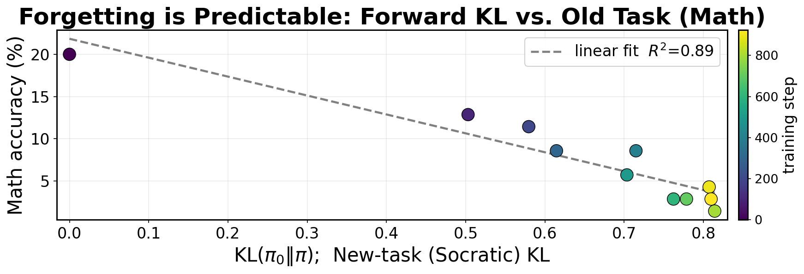
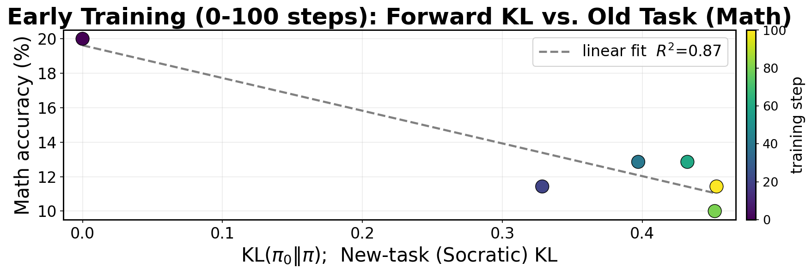
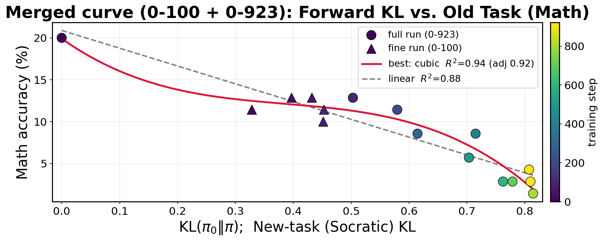
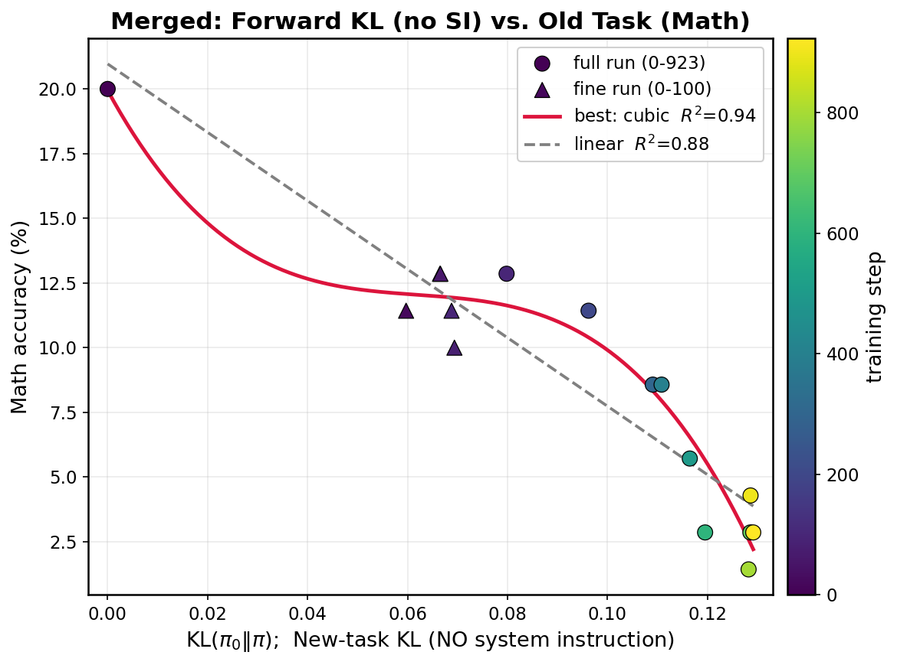
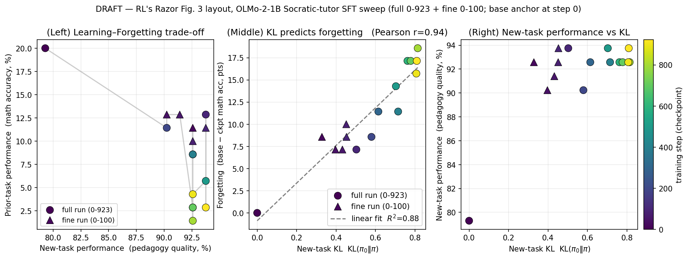

# KL POC — Forward KL vs. Catastrophic Forgetting (OLMo-2-1B Socratic tutor)

Proof-of-concept testing **RL's Razor** on our SFT setup: does the *forward KL* between the base
model and the fine-tuned checkpoint on the **new task** (Socratic tutoring) predict **forgetting**
of the **old task** (math/logic)? We trace the relationship across SFT training checkpoints.

This file is the single source of truth for the KL data. (Before this, KL lived only inside the
per-run `kl_by_checkpoint.json` / `master_summary*.json` files — see [Where the data lives](#where-the-data-lives).)

## Setup

- **Base model / anchor π₀:** `allenai/OLMo-2-0425-1B-Instruct`.
- **Fine-tune:** LoRA SFT on the SocraTeach Socratic-tutor data; checkpoints saved during training.
- **Old task (forgetting):** 70 math/logic prompts (GSM8K, MATH-500, BBH-logical-deduction, AIME-2024),
  graded with a deterministic final-answer rubric + blind LLM verifier for MATH-500 symbolic equivalence.
  Math prompts use **no system instruction** (just a boxing hint).
- **New task (KL):** forward KL `KL(π₀ ‖ π_ckpt)` estimated on the pedagogy (Socratic) prompts.
  Two variants are recorded per checkpoint:
  - **`kl_new_SI`** — pedagogy prompts *with* the pedagogical system instruction (the deployment condition).
  - **`kl_ped_noSI`** — the same pedagogy prompts *without* the system instruction.
- **Pedagogy quality:** blind LLM-as-judge, 8-dim rubric (0/0.5/1), 16 held-out dialogues.
  `pedD` = SFT **+SI** (deployment), `pedC` = SFT **no-SI**.
- **Forgetting** (RL's Razor definition) = base math accuracy − checkpoint math accuracy (points).

Two runs were collected:
- **Full run** (`full_0-923/`): checkpoints every 100 steps, base + c100…c923 (11 points).
- **Fine run** (`fine_0-100/`): early regime, checkpoints every 20 steps, base + c20…c100 (6 points),
  to densely sample the low-KL region. Same seed + data, so its first 100 steps mirror the full run.

---

## KL data

### Full run (0–923 steps)

| Point | Step | KL new (SI) | KL ped (no-SI) | Math acc % | Forgetting (pts) | Ped D (SFT+SI) | Ped C (SFT noSI) |
|-------|-----:|------:|------:|------:|------:|------:|------:|
| base | 0   | 0.000 | 0.000 | 20.00 | 0.00 | 0.793 | 0.438 |
| c100 | 100 | 0.503 | 0.080 | 12.86 | 7.14 | 0.938 | 0.500 |
| c200 | 200 | 0.580 | 0.096 | 11.43 | 8.57 | 0.902 | 0.613 |
| c300 | 300 | 0.615 | 0.109 | 8.57  | 11.43 | 0.926 | 0.695 |
| c400 | 400 | 0.715 | 0.111 | 8.57  | 11.43 | 0.926 | 0.684 |
| c500 | 500 | 0.703 | 0.116 | 5.71  | 14.29 | 0.938 | 0.641 |
| c600 | 600 | 0.762 | 0.120 | 2.86  | 17.14 | 0.926 | 0.684 |
| c700 | 700 | 0.779 | 0.129 | 2.86  | 17.14 | 0.926 | 0.688 |
| c800 | 800 | 0.814 | 0.128 | 1.43  | 18.57 | 0.926 | 0.664 |
| c900 | 900 | 0.807 | 0.129 | 4.29  | 15.71 | 0.926 | 0.797 |
| c923 | 923 | 0.810 | 0.129 | 2.86  | 17.14 | 0.938 | 0.762 |

**Full-run headline — forward KL (SI) vs. math accuracy (linear fit R² = 0.89):**



### Fine run (0–100 steps)

| Point | Step | KL new (SI) | KL ped (no-SI) | Math acc % | Forgetting (pts) | Ped D (SFT+SI) | Ped C (SFT noSI) |
|-------|-----:|------:|------:|------:|------:|------:|------:|
| base | 0   | 0.000 | 0.000 | 20.00 | 0.00  | 0.797 | 0.504 |
| c20  | 20  | 0.328 | 0.060 | 11.43 | 8.57  | 0.926 | 0.359 |
| c40  | 40  | 0.397 | 0.066 | 12.86 | 7.14  | 0.902 | 0.422 |
| c60  | 60  | 0.432 | 0.067 | 12.86 | 7.14  | 0.914 | 0.422 |
| c80  | 80  | 0.452 | 0.069 | 10.00 | 10.00 | 0.926 | 0.484 |
| c100 | 100 | 0.453 | 0.069 | 11.43 | 8.57  | 0.938 | 0.500 |

**Fine-run — early regime, forward KL (SI) vs. math accuracy:**



> **Cross-run note:** the shared `c100` checkpoint reads slightly differently between runs
> (SI KL 0.45 vs 0.50; no-SI KL 0.069 vs 0.080; acc 11.4% vs 12.9%). Same weights — the gap is
> sampling noise in the KL estimate and in math decoding. Treat merged mid-range structure with that in mind.

---

## Relationship: forward KL vs. math accuracy (merged, 16 points)

Best fit selected by AIC / adjusted-R² among linear, quadratic, cubic, exp-decay.

### vs. `kl_new_SI` (with system instruction)

| Model | R² | adj-R² | AIC |
|---|---:|---:|---:|
| **cubic** | **0.935** | **0.919** | **15.2** |
| quadratic | 0.900 | 0.884 | 20.2 |
| linear | 0.883 | 0.874 | 20.7 |
| exp-decay | 0.883 | 0.853 | 24.7 (degenerate → linear) |

Pearson r = −0.94.



### vs. `kl_ped_noSI` (no system instruction)

| Model | R² | adj-R² | AIC |
|---|---:|---:|---:|
| **cubic** | **0.941** | **0.926** | **13.7** |
| quadratic | 0.894 | 0.877 | 21.1 |
| linear | 0.877 | 0.868 | 21.5 |
| exp-decay | 0.877 | 0.846 | 25.5 (degenerate → linear) |

Pearson r = −0.94.



### RL's Razor Fig. 3 layout (merged full + fine)

Circles = full run (0–923), triangles = fine run (0–100); color = training step.



---

## Key findings

1. **Forward KL predicts forgetting.** Both KL variants correlate strongly and negatively with
   retained math accuracy (Pearson r ≈ −0.94; linear R² ≈ 0.88). This is the RL's-Razor signature
   for our SFT setup.
2. **Cubic is the statistical best fit (R² ≈ 0.94)**, capturing a three-phase shape: a steep early
   drop, a mid plateau, then a second decline at heavily-trained checkpoints. For a clean headline,
   linear (R² ≈ 0.88) or quadratic (R² ≈ 0.90) is the safer, simpler claim; the cubic's plateau is
   partly an artifact of the cross-run KL offset.
3. **Most forgetting happens in the first ~20 steps.** Math accuracy falls 20% → 11% by step 20 and
   only wobbles afterward, while KL jumps to ~0.33 (SI) immediately — the early regime the fine run
   was built to resolve.
4. **SI vs no-SI KL track forgetting about equally well here** (both r ≈ −0.94). The two KLs are
   near-collinear in this data, so it does **not** cleanly separate the SI-gating hypothesis; a
   regime where the two KLs diverge is needed to test gating directly.
5. **Pedagogy gating holds.** SFT+SI quality (`pedD`) rises to ~0.93 while SFT-no-SI (`pedC`) stays
   ~0.5 — the tutor behavior stays conditioned on the SI rather than baked in unconditionally.

---

## Where the data lives

```
curve_run/
├── Report_KL_POC.md            ← this file (all KL data + findings)
├── notebooks/                  ← Colab training+eval pipelines
│   ├── train_eval_kl_master_colab.ipynb      (full 0–923 run)
│   └── train_eval_kl_fine0_100_colab.ipynb   (fine 0–100 run)
├── full_0-923/                 ← full run
│   ├── master_summary.json       (KL + acc + forget + ped, per point)
│   ├── kl_by_checkpoint.json     (raw kl_new_SI, kl_ped_noSI)
│   ├── grading/                  (math grading, verifier outputs)
│   └── judging/                  (pedagogy judge inputs/keys/outputs, ped_summary.json)
├── fine_0-100/                 ← fine run (same layout)
│   ├── master_summary_0-100.json
│   ├── kl_by_checkpoint.json
│   ├── grading/
│   └── judging/
├── analysis/                   ← plotting + fitting scripts
│   ├── make_kl_plots.py            (full: KL_SI vs math acc, linear fit)
│   ├── make_kl_forgetting.py       (full: KL_SI vs forgetting)
│   ├── make_fig3_replica.py        (RL's Razor Fig.3 3-panel replica, merged full+fine)
│   ├── make_kl_plots_0-100.py      (fine: KL_SI vs math acc)
│   ├── make_merged_fit.py          (merged: KL_SI vs math acc, model search)
│   ├── make_merged_fit_noSI.py     (merged: KL_noSI vs math acc, model search)
│   └── figures/                    (all generated PNGs)
└── raw_data/                   ← original Colab zips + extracted outputs
    ├── curve_out-*.zip             (full run)
    ├── curve_out_0-100.zip         (fine run)
    └── full_0-923_raw/             (extracted full-run generations)
```

## Reproduce the figures / fits

```bash
cd curve_run/analysis
python3 make_merged_fit.py        # KL(SI) vs math acc + model comparison
python3 make_merged_fit_noSI.py   # KL(no-SI) vs math acc + model comparison
python3 make_kl_plots.py          # full-run headline figure
# scripts are path-independent (locate data via their own location) and write to analysis/figures/
```
